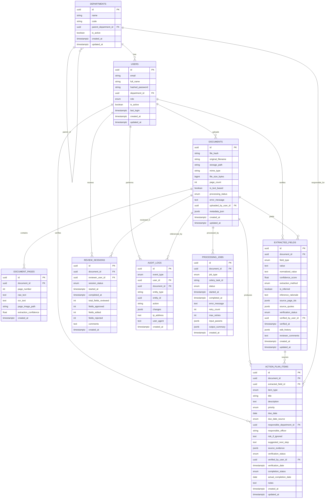

# ER Diagram

```mermaid
erDiagram
    DEPARTMENTS {
        uuid id PK
        string name
        string code
        uuid parent_department_id FK
        boolean is_active
        timestamptz created_at
        timestamptz updated_at
    }

    USERS {
        uuid id PK
        string email
        string full_name
        string hashed_password
        uuid department_id FK
        enum role
        boolean is_active
        timestamptz last_login
        timestamptz created_at
        timestamptz updated_at
    }

    DOCUMENTS {
        uuid id PK
        string file_hash
        string original_filename
        string storage_path
        string mime_type
        bigint file_size_bytes
        int page_count
        boolean is_text_based
        enum processing_status
        text error_message
        uuid uploaded_by_user_id FK
        jsonb metadata_json
        timestamptz created_at
        timestamptz updated_at
    }

    DOCUMENT_PAGES {
        uuid id PK
        uuid document_id FK
        int page_number
        text raw_text
        text ocr_text
        string page_image_path
        float extraction_confidence
        timestamptz created_at
    }

    EXTRACTED_FIELDS {
        uuid id PK
        uuid document_id FK
        enum field_type
        text value
        text normalized_value
        float confidence_score
        enum extraction_method
        boolean is_inferred
        text inference_rationale
        jsonb source_page_ids
        jsonb source_quotes
        enum verification_status
        uuid verified_by_user_id FK
        timestamptz verified_at
        jsonb edit_history
        text reviewer_comments
        timestamptz created_at
        timestamptz updated_at
    }

    ACTION_PLAN_ITEMS {
        uuid id PK
        uuid document_id FK
        uuid extracted_field_id FK
        enum item_type
        string title
        text description
        enum priority
        date due_date
        enum due_date_source
        uuid responsible_department_id FK
        string responsible_officer
        text risk_if_ignored
        text suggested_next_step
        jsonb source_evidence
        enum verification_status
        uuid verified_by_user_id FK
        timestamptz verification_date
        enum completion_status
        date actual_completion_date
        text notes
        timestamptz created_at
        timestamptz updated_at
    }

    REVIEW_SESSIONS {
        uuid id PK
        uuid document_id FK
        uuid reviewer_user_id FK
        enum session_status
        timestamptz started_at
        timestamptz completed_at
        int total_fields_reviewed
        int fields_approved
        int fields_edited
        int fields_rejected
        text comments
        timestamptz created_at
    }

    AUDIT_LOGS {
        uuid id PK
        enum event_type
        uuid user_id FK
        uuid document_id FK
        string entity_type
        uuid entity_id
        string action
        jsonb changes
        inet ip_address
        text user_agent
        timestamptz created_at
    }

    PROCESSING_JOBS {
        uuid id PK
        uuid document_id FK
        enum job_type
        string celery_task_id
        enum status
        timestamptz started_at
        timestamptz completed_at
        text error_message
        int retry_count
        int max_retries
        jsonb input_params
        jsonb output_summary
        timestamptz created_at
    }

    DEPARTMENTS ||--o{ USERS : has
    DEPARTMENTS ||--o{ DEPARTMENTS : parent_of
    USERS ||--o{ DOCUMENTS : uploads
    USERS ||--o{ EXTRACTED_FIELDS : verifies
    USERS ||--o{ ACTION_PLAN_ITEMS : verifies
    USERS ||--o{ REVIEW_SESSIONS : reviews
    USERS ||--o{ AUDIT_LOGS : performs
    DOCUMENTS ||--o{ DOCUMENT_PAGES : contains
    DOCUMENTS ||--o{ EXTRACTED_FIELDS : yields
    DOCUMENTS ||--o{ ACTION_PLAN_ITEMS : produces
    DOCUMENTS ||--o{ REVIEW_SESSIONS : reviewed_in
    DOCUMENTS ||--o{ AUDIT_LOGS : referenced_by
    DOCUMENTS ||--o{ PROCESSING_JOBS : processed_by
    EXTRACTED_FIELDS ||--o{ ACTION_PLAN_ITEMS : sources
    DEPARTMENTS ||--o{ ACTION_PLAN_ITEMS : responsible_for
```